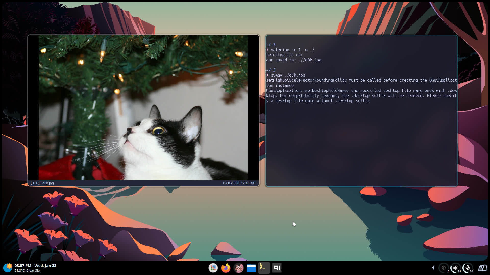

# Valerian (ناردين)
#### simple program to fetch cars from [TheCatAPI](https://thecatapi.com/) - بريمج صغير لجلب صور قطط
#### It's a [ccat copycat](https://github.com/plastic-bottleneck/ccat) but way slower and more bloated :) &nbsp;<span dir="rtl">نفس ccat لكن ابطأ وأكبر</span> </h2>



<h2 align="center"> <span dir="ltr">Installation </span>&nbsp;<span dir="rtl">تثبيت </span> </h2>

```bash
git clone https://codeberg.org/EvilLary/Valerian.git
cd Valerian
cargo build --release
cp ./target/release/valerian $HOME/.local/bin/
```
<h2 align="center"> <span dir="ltr">Usage</span>&nbsp;<span dir="rtl">استعمال</span> </h2>

```bash
valerian -c <number-of-cars> -o <output-directory>
```

```bash
valerian -c 3 -o $HOME/Downloads/
```
